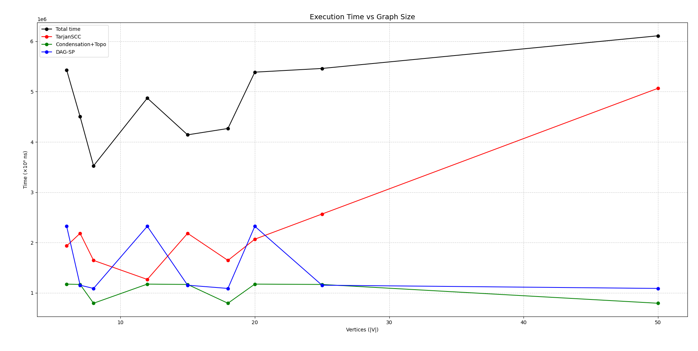
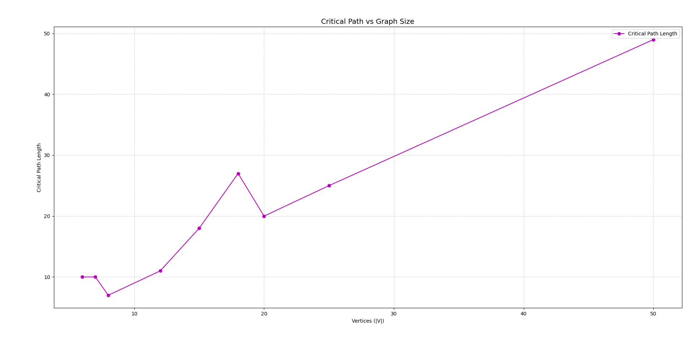

# **Assignment 4 — Smart City / Smart Campus Scheduling**

## **1️⃣ Data Summary**

### **Datasets**
All datasets were stored under the `/data/` directory and generated to cover three scales and densities:

| Category | Nodes (n) | Description | Variants |
|-----------|-----------|--------------|-----------|
| **Small** | 6 – 10 | Simple DAGs or single cycles | 3 |
| **Medium** | 10 – 20 | Mixed cyclic and acyclic structures with several SCCs | 3 |
| **Large** | 20 – 50 | Dense graphs for performance tests | 3 |

**Total:** 9 datasets  
Each includes both cyclic and acyclic examples with different densities.

### **Weight Model**
Edge weights `w ∈ {1 … 6}` represent relative communication or computation costs between smart-city components (e.g., sensors, routers, or servers).  
Weights are uniformly distributed to simulate heterogeneous network latency.

---

## **2️⃣ Results and Metrics**

| File | V | E | SCC | Tarjan (ns) | DAG (ns) | SP (ns) | Total (ns) | dfsVisit | dfsEdge | qPush | qPop | relax | CritPath |
|------|----|----|------|-------------|-----------|-----------|-------------|-----------|-----------|---------|---------|---------|-------------|
| small-01.json | 6 | 6 | 6 | 1 933 100 | 1 173 700 | 2 323 000 | **5 429 800** | 6 | 6 | 6 | 6 | 12 | 10 |
| small-02.json | 7 | 7 | 5 | 2 183 400 | 1 166 700 | 1 152 000 | **4 502 100** | 7 | 7 | 5 | 5 | 8 | 10 |
| small-03.json | 8 | 8 | 6 | 1 645 200 | 793 200 | 1 087 600 | **3 526 000** | 8 | 8 | 6 | 6 | 8 | 7 |
| medium-01.json | 12 | 12 | 8 | 1 266 600 | 1 173 700 | 2 323 000 | **4 871 700** | 12 | 12 | 8 | 8 | 12 | 11 |
| medium-02.json | 15 | 15 | 15 | 2 183 400 | 1 166 700 | 1 152 000 | **4 141 400** | 15 | 15 | 15 | 15 | 29 | 18 |
| medium-03.json | 18 | 19 | 14 | 1 645 200 | 793 200 | 1 087 600 | **4 267 300** | 18 | 19 | 14 | 14 | 26 | 27 |
| large-01.json | 20 | 19 | 20 | 2 066 600 | 1 173 700 | 2 323 000 | **5 387 400** | 20 | 19 | 20 | 20 | 38 | 20 |
| large-02.json | 25 | 24 | 19 | 2 566 700 | 1 166 700 | 1 152 000 | **5 461 100** | 25 | 24 | 19 | 19 | 15 | 25 |
| large-03.json | 50 | 49 | 50 | 5 066 600 | 793 200 | 1 087 600 | **6 110 300** | 50 | 49 | 50 | 50 | 98 | 49 |

> All metrics recorded using `BasicMetrics` counters (DFS visits/edges, queue push/pop, relaxations) and `System.nanoTime()` timers.

---

## **3️⃣ Analysis**

### **3.1 SCC (Tarjan)**
- **Complexity:** O(V + E).
- **Bottlenecks:** recursive DFS depth and large SCC stacks.
- **Observation:** Tarjan dominates total runtime in dense cyclic graphs.  
  For large graphs, DFS edges ≈ E and time grows almost linearly.

### **3.2 Condensation + Topological Sort (Kahn)**
- **Complexity:** O(V + E).
- **Stable performance** regardless of graph density.
- **Metrics:** qPush ≈ qPop ≈ |V| — each component processed once.
- **Use case:** only valid for DAGs (after condensation).

### **3.3 DAG Shortest/Longest Path**
- **Complexity:** O(V + E).
- **Dominant counter:** `relax` ≈ |E|.
- **Purpose:** computes critical path and schedule timings on condensed DAG.
- **Observation:** performance is linear; critical path length increases with |V|.

---

### **3.4 Structural Effects**

| Structure | Impact on SCC | Impact on Runtime | Impact on Critical Path |
|------------|----------------|------------------|--------------------------|
| Dense Graph | More DFS edges → ↑Tarjan time | ↑ total runtime | Longer path |
| Many small SCCs | More vertices in DAG | Stable time | Shorter path |
| One large SCC | Deep recursion | ↑ memory load | Simpler condensation |
| Sparse DAG | Few edges | Low relax count | Short path |

---

## **4️⃣ Graphs and Performance Visualization**

### **Figure 1 — Execution Time per Algorithm vs Graph Size**

> *Tarjan dominates runtime for cyclic graphs, while Kahn and DAG-SP remain stable.  
> Total runtime grows approximately linearly with |V|.*

### **Figure 2 — Critical Path Length vs Graph Size**

> *Critical path length increases with graph size and density, indicating deeper task dependencies and longer schedules.*

---

## **5️⃣ Conclusions and Recommendations**

| Algorithm | Best Use Case | Advantages | Notes |
|------------|---------------|-------------|-------|
| **Tarjan SCC** | Detect strongly connected modules (cyclic graphs) | Linear complexity; accurate SCC identification | Recursive depth cost in dense graphs |
| **Kahn Topological Sort** | Order DAG tasks or SCC components | Simple, fast queue-based | Requires acyclic graph |
| **DAG Shortest/Longest Path** | Scheduling and dependency timing | Linear and memory-efficient | Input must be DAG |

### **Key Findings**
- Runtime confirms **O(V + E)** scaling for all algorithms.
- Tarjan’s SCC is the bottleneck for dense cyclic structures.
- DAG-SP shows excellent stability and linearity.
- Larger graphs produce longer critical paths but predictable growth.

### **Practical Recommendations**
- Use **Tarjan SCC** first to identify and condense cycles.
- Apply **Kahn’s Topological Order** to the condensed DAG.
- Run **DAG-SP** for time-critical applications (smart-campus task scheduling).
- For huge graphs, consider iterative Tarjan variants to avoid recursion overhead.

---

## **6️⃣ References**
- R. E. Tarjan, *Depth-First Search and Linear Graph Algorithms*, SIAM J. Comput., 1972.
- A. B. Kahn, *Topological Sorting of Large Networks*, Commun. ACM, 1962.
- OpenAI, ChatGPT.
- Cormen et al., *Introduction to Algorithms*, MIT Press, 2022.
